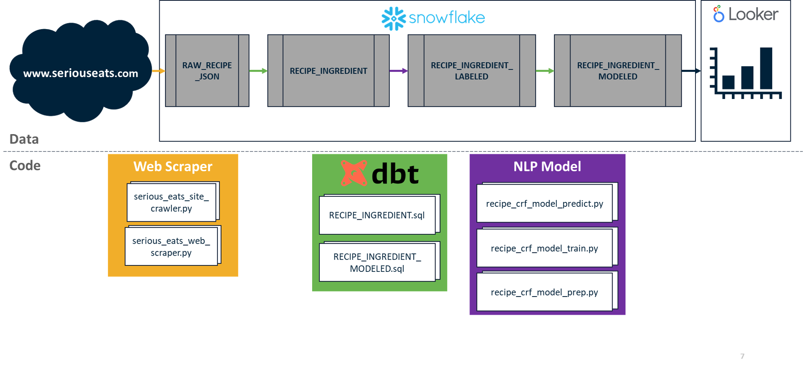

# Recipe Analysis with Python, dbt, and Snowflake 

Exploring the underlying structure of recipes from www.seriouseats.com. First use case is to understand the [Baker's Percentage](https://www.kingarthurbaking.com/pro/reference/bakers-percentage) of bread recipes. 

Project uses:
* Python BeautifulSoup for webscraping
* Python python-crfsuite for natural language processing (NLP)
* dbt for SQL-based data transforms
* Snowflake for data persistence 

Architecture:
